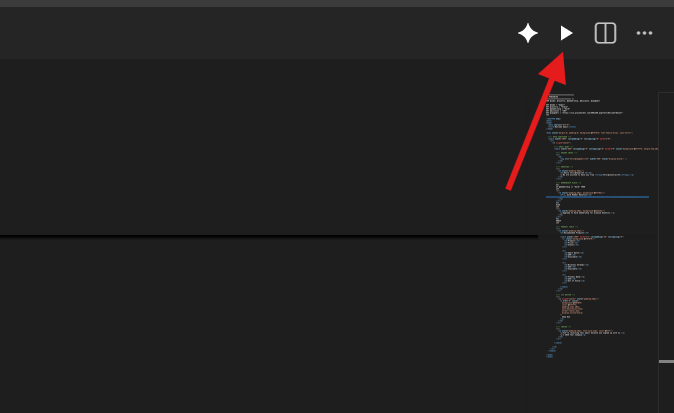
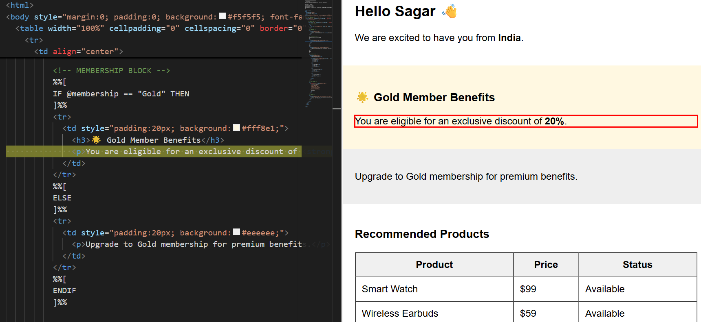

# HTML AMP Source Mapper

Preview HTML with AMPscript and seamlessly map preview elements back to source code in Visual Studio Code.

---

## 🚀 Features

- 🔍 Live preview of HTML with AMPscript support (mock rendering)
- 🎯 Click any element in preview → automatically highlights corresponding code in editor
- ▶️ Quick access via Play button (top-right corner) in VS Code
- ⚡ Lightweight and developer-friendly workflow


## 🛠 How to Use

### ▶️ Open Preview (Play Button Method)

1. Open your HTML / AMPscript file in VS Code  
2. Look at the top-right corner of the editor  
3. Click the ▶️ Play icon  
4. This will open the HTML AMP Preview panel  

---

### 🔍 Alternative Method (Command Palette)

1. Press Ctrl + Shift + P  
2. Search: Open AMP Preview  
3. Press Enter  

---

## 🎯 Click-to-Highlight Feature

Once preview is open:

1. Click on any element in the preview  
2. The extension will:
   - Identify the corresponding line/block  
   - Automatically highlight it in the editor  
   - Scroll to that section  

👉 This helps quickly map UI ↔ code

---

## ⚠️ Important Notes

- AMPscript is simulated, not executed via Salesforce Marketing Cloud  
- Complex logic (IF, loops, API data) may not fully render  
- Designed for development and debugging purposes  

---

## 📂 Supported Files

- .html  
- .htm  
- AMPscript inside HTML (`%%[ ]%%`, `%%=v()=%%`)  

---

##  📸 Preview

[Watch Full Demo](https://your-video-link.com)

---

## 💡 Example

```html
%%[
VAR @name
SET @name = "Sagar"
]%%

<h1>Hello %%=v(@name)=%%</h1>